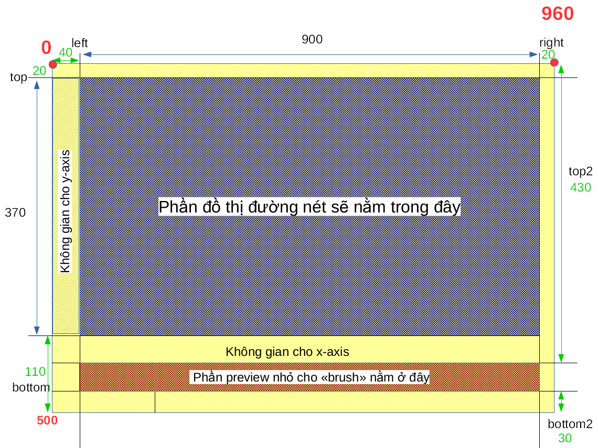

## Nội dung

- Chart: Vietnam Consumer Price Index between year 2010 - 2016
- Source of data: [[General Statistic Office of Vietnam]](https://www.gso.gov.vn/Default_en.aspx?tabid=491)
- Date of taken: 28th April 2018
- Dựa theo [Brush & Zoom](https://bl.ocks.org/mbostock/34f08d5e11952a80609169b7917d4172) của Mike Bostock.

## Vẽ chart

### Lên layout và setup scale cho các trục x, y



```javascript
const svg = d3.select("svg"),
    margin = { top: 20, right: 20, bottom: 110, left: 40 },
    margin2 = { top: 430, right: 20, bottom: 30, left: 40 },
    width = +svg.attr("width") - margin.left - margin.right,
    height = +svg.attr("height") - margin.top - margin.bottom,
    height2 = +svg.attr("height") - margin2.top - margin2.bottom;

const x = d3.scaleTime().range([0, width]),
    x2 = d3.scaleTime().range([0, width]),
    y = d3.scaleLinear().range([height, 0]),
    y2 = d3.scaleLinear().range([height2, 0]);
```

### Khởi tạo 2 behavior: zoom và brush

**[Brush](https://github.com/d3/d3-brush)**: 
- Giúp người dùng lựa chọn 1 vùng để xem dựa vào thao tác của chuột hoặc vuốt chạm. Gọi là vùng, nhưng nó có thể 1 chiều hoặc 2 chiều.
- Ở đây gọi `d3.brushX()`, nghĩa là chỉ tạo vùng 1 chiều dọc theo trục X.
- Brush lắng nghe sự kiện thông qua `.on("tên-sự-kiện", event-handler)`:
    - sự kiện ở đây là "brush end": nghĩa là khi hành động "brush" kết thúc (ví dụ như chuột ngừng và nhả ra), thì sẽ gọi event handler.
    - event handler ở đây là hàm `brushed` (được khai báo ở đoạn tiếp theo).

```javascript
const brush = d3.brushX()
    .extent([[0, 0], [width, height2]])
    .on("brush end", brushed);
```

**[Zoom](https://github.com/d3/d3-zoom)**:
- Giúp người dùng phóng to, thu nhỏ một vùng nào đấy.
- Tỷ lệ thu phóng được thiết lập từ 1 (nhỏ nhất) đến vô cùng thông qua `zoom.scaleExtent([1, Infinity])`.
- Việc panning, dịch chuyển theo trục X được giới hạn bởi `translateExtent()`. Do tham số truyền vào là 1 mảng chứa 2 điểm góc `[0, 0]` và `[width, height]` cho nên việc kéo bản vẽ qua trái qua phải chỉ được thực hiện trong đúng vùng này. Thực tế là không thể kéo được. Nếu bỏ phần này đi thì sẽ kéo được sang trái/ sang phải, trục thời gian sẽ tự động được tính về trước 2011, hoặc sau 2016.
```javascript
const zoom = d3.zoom()
    .scaleExtent([1, Infinity])
    .translateExtent([[0, 0], [width, height]])
    .extent([[0, 0], [width, height]])
    .on("zoom", zoomed);
```

### Khởi tạo area để vẽ area-chart

- Do ta dùng area chart để vẽ đồ thị nên cần khởi tạo `area` từ d3-shape thông qua `d3.area()`.
- Dựa vào các thiết lập `.x`, `.y0`, `.y1`, cũng như `.curve()`, `d3.area()` sẽ tính ra giá trị của `path` truyền vào cho `attribute("d")` ở phần bên dưới.
- Do có 2 area chart (to và nhỏ, trên và dưới), nên cần tạo cả area và area2.
```javascript
const area = d3.area()
            .curve(d3.curveMonotoneX)
            .x(function (d) { return x(d.date); })
            .y0(height)
            .y1(function (d) { return y(d.price); });
```

### Khởi tạo vùng defs
- Tất cả những gì được đặt trong `<defs>` sẽ chưa được hiển thị ngay trừ khi nó được gọi đến sau đó.
- Bên trong `<defs>` là 1 hình chữ nhật `<rect>` nhưng gán với "clipPath". Một khi được kích hoạch, tất cả những gì đặt trong "clipPath" mới được hiển thị (trường hợp này là bên trong của hình chữ nhật), còn bên ngoài sẽ bị che đi.
- Việc kích hoạt clipPath ở trường hợp này là thông qua phần external styll `.area {clip-path: url(#clip);}`
- Tọa độ của clipPath không quan trọng. Chỉ cần kích thước của nó đúng bằng kích thước ta cần hiển thị, rồi kích hoạt nó bên trong vùng "area" nói trên, thì nó sẽ tự căn về tọa độ dựa theo "area".
- Nếu không có clipPath? sẽ thấy phần area tràn ra bên ngoài vùng area (tất nhiên vẫn trong vùng svg). Từ đây hiểu là area là vùng bên trong hiển thị thông tin chính.

```javascript
svg.append("defs").append("clipPath")
            .attr("id", "clip")
            .append("rect")
            .attr("width", width)
            .attr("height", height);
```

```css
.area {
    fill: steelblue;
    clip-path: url(#clip);
}
```

### Domain và scale

```javascript
domainX:[
    "2009-12-31T17:00:00.000Z",
    "2016-11-30T17:00:00.000Z"]

domainX2:[
    "2009-12-31T17:00:00.000Z",
    "2016-11-30T17:00:00.000Z"]
```